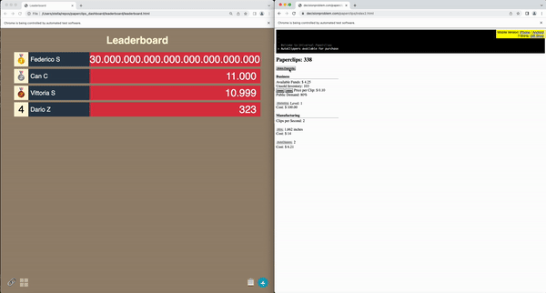

Leaderboard for Universal Paperclips
=======================

[Universal Paperclips](https://www.decisionproblem.com/paperclips/) is a popular clicker game by Frank Lantz, all rights to him!

I wanted to play the game with friends in a competitive way to see who can finish it first, or who can create the most paperclips in a limited amount of time, so I decided to create a mechanism to retrieve the number of paperclips from each player and display it in a leaderboard! 

This makes the game so fun to play!

This is a small project developed for personal reasons in a few hours. It's a bit hacky and not refined, but it does work so I decided to share it.

The leaderboard web UI is a slightly modified version of [this project](https://github.com/tgogos/leaderboard), support the original creator!

Installation
----------------

1. Install Python, with or without Conda

2. Install Selenium

   `pip install selenium`

3. Install the Python MQTT client

   `pip install paho-mqtt`

4. Install Docker from the official website

Usage
------------------

1. Run the MQTT server

   `docker run -d --name emqx -p 1883:1883 -p 8083:8083 -p 8084:8084 -p 8883:8883 -p 18083:18083 emqx/emqx`

   Might need sudo, depending on your docker installation

2. Start the leaderboard

   You can specify in the file the IP and Port of the MQTT server. It can be localhost, of course.

   `python leaderboard.py`

3. Start the game

   You can specify in the file the IP and Port of the MQTT server. It can be localhost, of course.

   `python paperclips.py`

   It will ask you for your username to be displayed in the leaderboard.

   It will also use such username to save the game cache in your local directory.

Notes
------
The information is sent to the MQTT server every 2 seconds.

The leaderboard is upadated every 5 seconds.

If the leaderboard crashes, it can be restarted without impacting the games.

If a game crashes, it can be restarted with the same username and it will load the game cache from the local directory.
